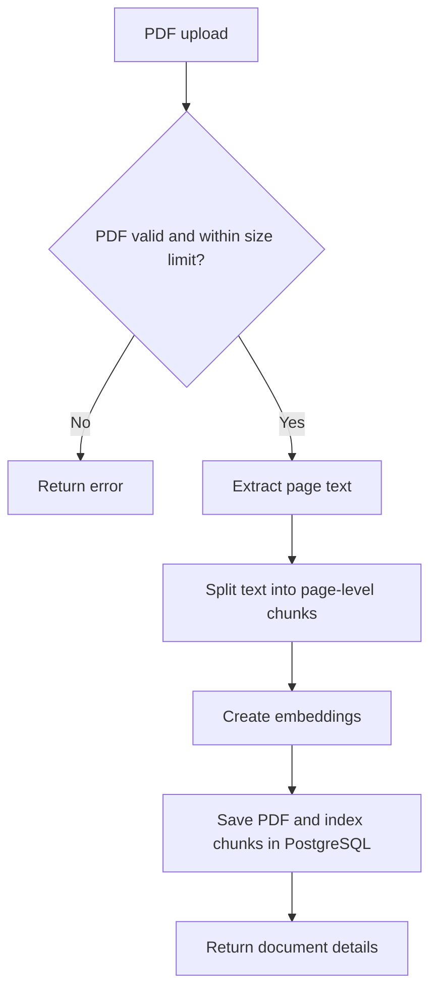
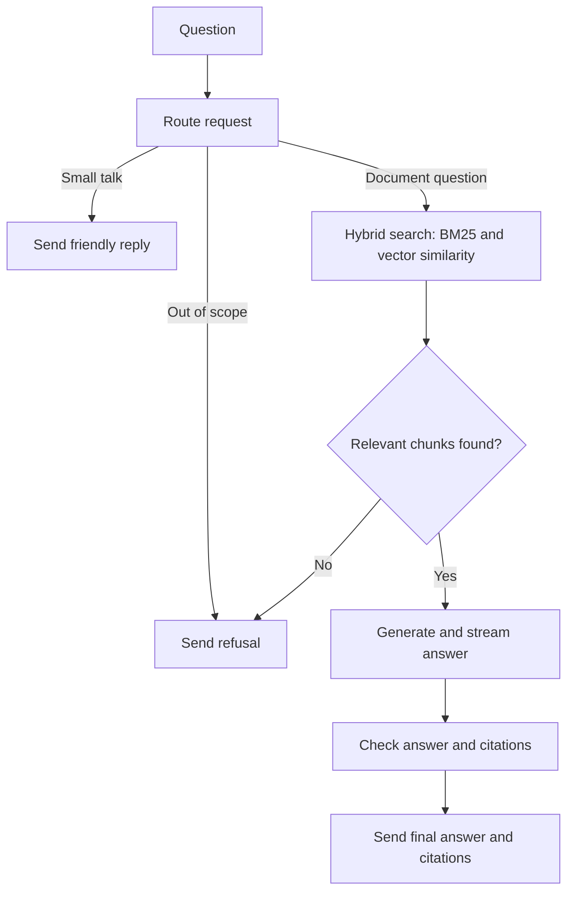

# Document Q&A Agent

## Project description

Upload PDF documents and ask questions about their content. The app searches the documents, returns an answer with page citations, and says **"I don't know."** when it cannot give a supported answer.

## Tech stack

- Python and FastAPI for the API
- LangGraph to manage the question-answering flow
- PostgreSQL with pgvector to store and search document chunks
- Sentence Transformers to create text embeddings
- Gemini by default; OpenRouter and Groq are also supported
- LangSmith for LangGraph tracing and observability
- Docker Compose to run the API and database
- Server-Sent Events (SSE) for `/ask` responses

## Folder structure

```text
app/
├── agents/       # Router, retriever, answer and checker agents
├── api/          # API routes and dependencies
├── chunking/     # Splits document text into chunks
├── core/         # Settings and shared decorators
├── embeddings/   # Text embedding model
├── ingestion/    # PDF loading and text extraction
├── llm/          # Gemini, OpenRouter and Groq providers
├── prompts/      # Prompts used by the agents
├── retrieval/    # Hybrid keyword and vector search
├── schemas/      # Data models
├── utils/        # Shared utilities
└── vector_db/    # PostgreSQL and pgvector operations

docs/             # Uploaded PDFs
logs/             # Application logs
docker-compose.yml
Dockerfile
```

## How the endpoints work

### `POST /documents`

1. Checks that the upload is a PDF and within the size limit.
2. Extracts text and page numbers.
3. Splits text into chunks, keeping each chunk on its original page.
4. Creates embeddings for the chunks and stores them with document details.
5. Returns the document name, page count and chunk count.



### `POST /ask`

1. Routes the question. Small talk gets a short reply; out-of-scope requests get **"I don't know."**
2. Searches document chunks using keyword search (BM25) and vector similarity, then combines the results.
3. If no relevant chunks are found, returns **"I don't know."**
4. The LLM drafts an answer from the retrieved text and streams it to the client.
5. A checker verifies the answer; the API then sends the validated citations and a final answer event.



## Environment setup

Copy `.env.example` to `.env`, then add your API keys and choose the LLM provider. Keep `.env` private; it contains secrets.

```powershell
Copy-Item .env.example .env
```

Build and start the API and database containers:

```powershell
docker compose up --build -d
```

## Available endpoints

| Method | Endpoint       | Purpose                                    |
| ------ | -------------- | ------------------------------------------ |
| `POST` | `/documents`   | Upload and index a PDF document            |
| `POST` | `/ask`         | Ask a question and receive an SSE response |
| `GET`  | `/health`      | Check API and vector database health       |
| `GET`  | `/`            | Get basic service information              |
| `WS`   | `/ws/progress` | Receive live agent progress updates        |
| `GET`  | `/docs`        | Open interactive API documentation         |
